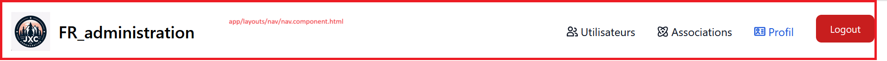
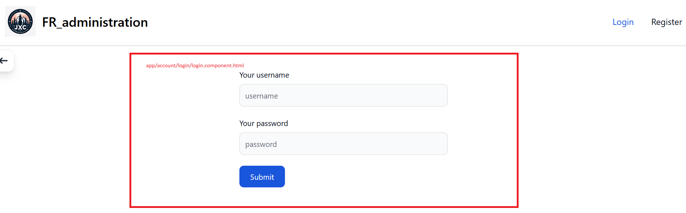
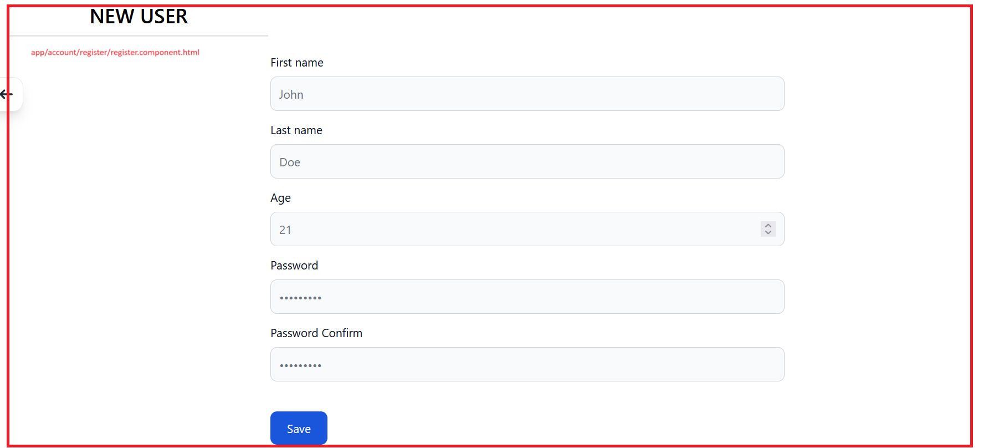
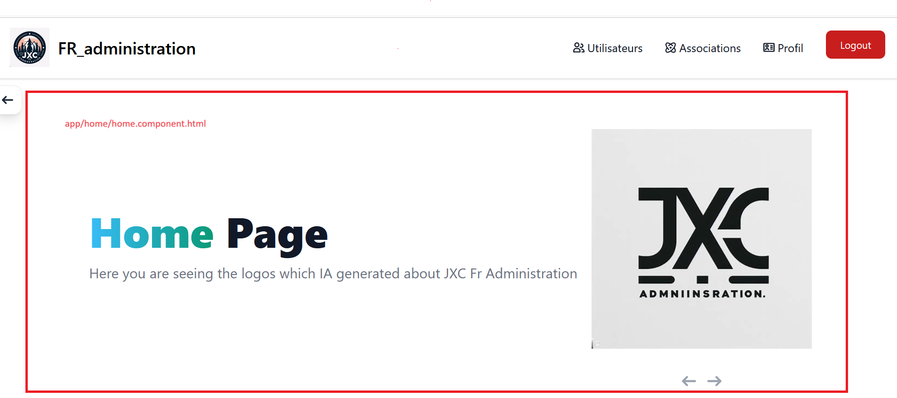
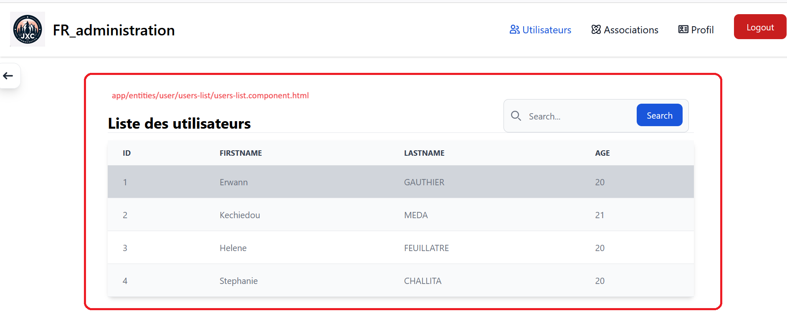
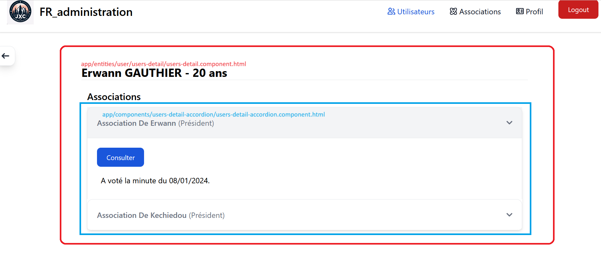
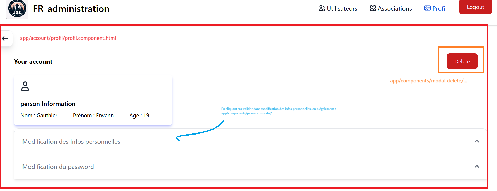
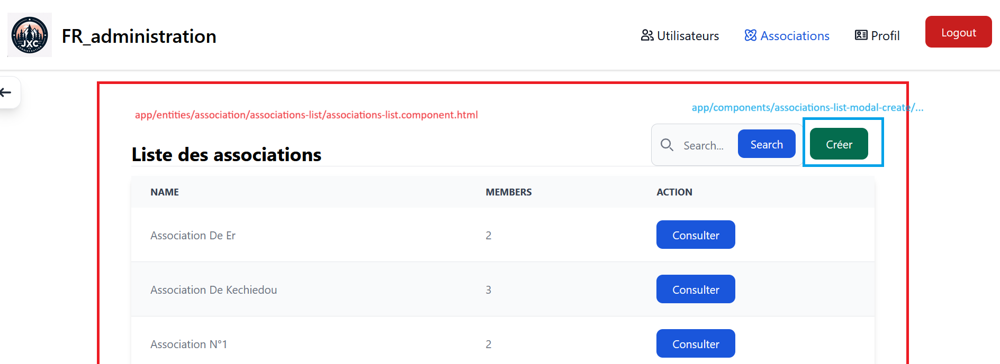
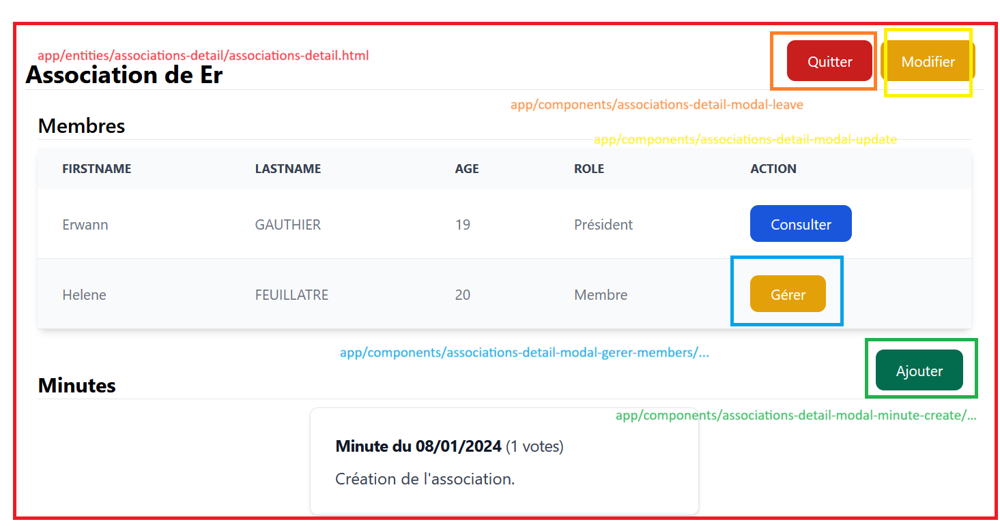

# FR Administration - Front

## Erwann GAUTHIER & Kechiedou MEDA

## Nos choix d'implémentation

### Utilisateurs

- Un utilisateur est créé lorsqu'une personne s'enregistre sur le site.
  - [http://localhost:4200/register](http://localhost:4200/register)
- L'utilisateur peut se connecter et accéder aux fonctionnalités du site.
  - [http://localhost:4200/login](http://localhost:4200/login)
  - Pour se connecter l'utilisateur doit saisir son numéro d'identifiant et son mot de passe.
- Possibilité de voir la liste de tous les utilisateurs.
  - [http://localhost:4200/users](http://localhost:4200/users)
  - Possibilité de rechercher des utilisateurs par leur prénom et/ou leur nom.
- Possibilité de voir le détail d'un utilisateur.
  - [htpp://localhost:4200/users/{id}](http://localhost:4200/users)
  - Liste les associations auxquelles l'utilisateur fait partie et liste les minutes auxquelles l'utilisateur a participé au sein de chaque association.
- Possibilité de voir son profil
  - [http://localhost:4200/profil](http://localhost:4200/profil)
  - Possibilité de visualiser les informations de son compte (username, age, firstname, lastname)
  - Possibilité de modifier ses informations sans modifier le mot de passe
  - Possibilité de modifier son mot de passe
  - Possibilité de supprimer son compte
  - Nous chargeons les infos du profil du user sans utiliser de ``resolver``.

### Associations

- Possibilité de voir la liste de toutes les associations.
  - [http://localhost:4200/associations](http://localhost:4200/associations)
  - Possibilité de rechercher des associations par leur nom.
- Possibilité de créer une association.
  - [http://localhost:4200/associations](http://localhost:4200/associations)
  - N'importe quel utilisateur peut créer une association.
  - L'utilisateur qui créer l'association se voit automatiquement attribuer le rôle de président.
- Possibilité de voir le détail d'une association.
  - [http://localhost:4200/associations/{id}](http://localhost:4200/associations)
- Possibilité de rejoindre/quitter une association.
  - [http://localhost:4200/associations/{id}](http://localhost:4200/associations)
  - Si l'association n'a qu'un membre alors, il n'est pas possible de la quitter, mais uniquement la supprimer.
  - Si l'association ne contient qu'un seul président et que celui-ci souhaite quitter l'association, il devra nommer un nouveau président avant de quitter l'association.
  - Lorsqu'un utilisateur rejoint une association, il se voit automatiquement attribuer le rôle de membre.
- Possibilité de gérer l'association.
  - [http://localhost:4200/associations/{id}](http://localhost:4200/associations)
  - **Réservé aux présidents d'association.**
  - Possibilité de modifier le nom de l'association.
  - Possibilité de supprimer l'association.
  - Possibilité de changer le rôle d'un membre (sauf président) de l'association.
  - Possibilité de virer un membre (sauf président) de l'association.
  - Possibilité de créer une minute.

## Liens entre nos composants

Nous allons lister toutes nos pages, sur les images il est possible de voir tous les composants utilisés dans la page. On listera ensuite les différentes routes que nous pouvons rejoindre à travers chaque page.

**Navbar**

- 
- 
- Déconnecté - Permet d'accéder à :
  - [Login](http://localhost:4200/login)
  - [Register](http://localhost:4200/register)
- Connecté - Permet d'accéder à :
  - [Users List](http://localhost:4200/users)
  - [Association List](http://localhost:4200/associations)
  - [Profil](http://localhost:4200/profil)

**Login**

- 

**Register**

- 

**Home Page**

- 

**Users List**

- 
- Permet d'accéder à :
  - [User Detail](http://localhost:4200/users) en cliquant sur la ligne de l'utilisateur qu'on souhaite regarder.

**User Detail**

- 
- Permet d'accéder à :
  - [Association Detail](http://localhost:4200/associations) en cliquant sur consulter

**User Profil**

- 

**Association List**

- 
- Permet d'accéder à :
  - [Association Detail](http://localhost:4200/associations) en cliquant sur consulter ou sur la ligne de l'association qu'on souhaite regarder.

**Association Detail**

- 
- Permet d'accéder à :
  - [User Detail](http://localhost:4200/users) en cliquant sur consulter.

## Choix de Flowbite pour le Styling dans notre Projet Web

- **Facilité d'Intégration**
  - Flowbite offre une intégration facile avec Angular et NestJs, ce qui simplifie le processus de mise en place et réduit le temps de développement. Son architecture modulaire s'aligne bien avec la structure de nos projets, facilitant l'incorporation des composants stylisés.
- **Taille Légère**
  - Comparé à d'autres frameworks comme Bootstrap, Flowbite présente une taille légère. Cela se traduit par des temps de chargement plus rapides, ce qui améliore l'expérience utilisateur, surtout sur des connexions réseau plus lentes ou des dispositifs mobiles.
- **Flexibilité Personnalisable**
  - Flowbite offre une flexibilité accrue en matière de personnalisation. Son approche basée sur les classes utilitaires permet une adaptation rapide aux besoins spécifiques de notre application sans générer de surcharge inutile de styles. Il s'aligne également bien avec l'approche de conception "Atomic CSS".
- **Thèmes Préconçus**
  - Flowbite propose une variété de thèmes préconçus esthétiquement plaisants. Cela peut accélérer le processus de conception tout en offrant une base solide sur laquelle construire. Ces thèmes peuvent être facilement personnalisés pour s'aligner avec l'identité visuelle de notre projet.
- **Documentation Complète**
  - La documentation complète de Flowbite offre un guide détaillé sur la manière d'utiliser chaque composant. Cela facilite la compréhension et l'apprentissage, réduisant ainsi la courbe d'apprentissage pour les membres de l'équipe.
- **Écosystème Actif**
  - Flowbite bénéficie d'une communauté active et d'une mise à jour régulière, assurant la stabilité du framework et la prise en charge continue des dernières normes et fonctionnalités.
- **Performance Optimisée**
  - Les styles de Flowbite sont conçus avec la performance à l'esprit. L'utilisation efficace des propriétés CSS et des bonnes pratiques de conception garantit une expérience utilisateur fluide et réactive.

En conclusion, le choix de Flowbite pour le stylisme dans notre projet s'appuie sur sa facilité d'intégration, sa légèreté, sa flexibilité personnalisable, ses thèmes préconçus, sa documentation complète, son écosystème actif et ses performances optimisées, faisant de lui un candidat convaincant pour répondre à nos besoins spécifiques.
